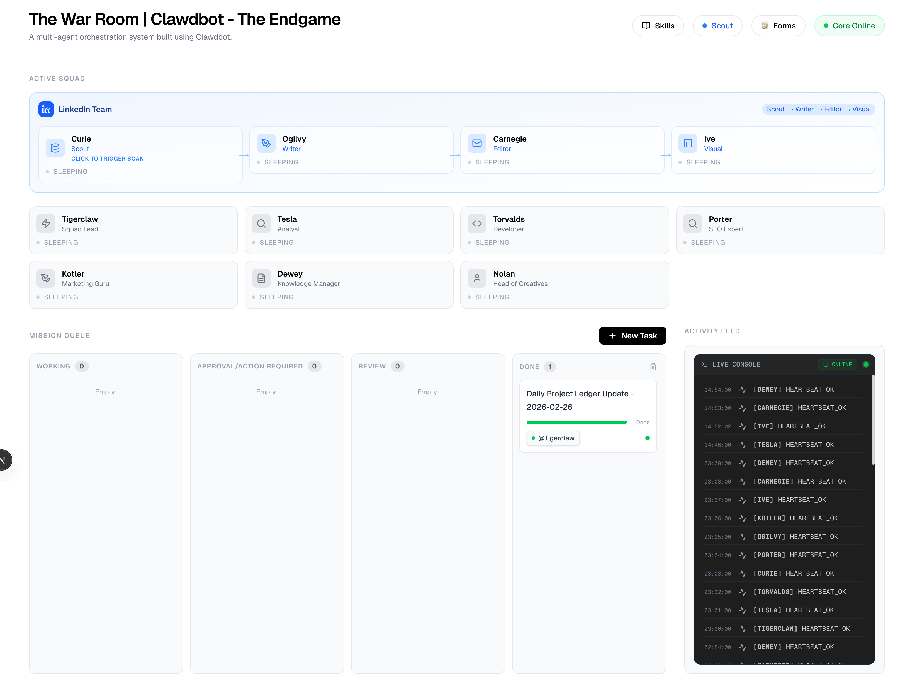

# Clawdbot the Endgame

Clawdbot the Endgame is a local-first multi-agent operating system for high-signal work. It combines a Next.js command center, a Convex-backed mission graph, and specialized agents that can research, write, score jobs, assemble application packages, and learn from inbox feedback.




## Product walkthrough

Watch the full product walkthrough here:

- [Product walkthrough (MP4)](./docs/product-walkthrough.mp4)

The video shows the operator UI, mission queue, agent orchestration flow, and the hiring workflow end to end.

## Why this project matters

Most agent demos stop at "chat with one model." Clawdbot the Endgame is built around orchestration instead of chat:

- A persistent task system with agent workflows and review loops
- A hiring engine that imports public ATS feeds, scores fit, and drafts factual application packages
- A scout layer for source ingestion, knowledge capture, and signal ranking
- A feedback loop that can read Gmail outcomes and feed them back into optimization snapshots

This is the project I would use to show how I think about agent products: operational visibility, human approval gates, structured memory, and real workflows that touch the messy parts of the internet.

## Stack

- Next.js 16 + React 19
- Convex for data, actions, and real-time state
- Tailwind CSS 4
- TypeScript throughout
- Optional integrations with OpenAI, Google, Brave, Voyage, and Telegram

## Repo layout

- `app/` - operator UI, hiring pipeline, scout surfaces, local setup pages
- `convex/` - schema, mutations, actions, and orchestration logic
- `gateway/` - background agent loop, scheduler, Telegram bridge
- `services/` - LLM, browser, image, and memory helpers
- `squad/` - agent role definitions and pipeline prompts
- `chrome-extension/` - form-filling companion extension
- `scripts/import_baseline_profile.ts` - imports candidate evidence into the hiring engine
- `data/candidate-profile/` - local-only resume and evidence files for profile import

## Local setup

1. Install dependencies:

```bash
npm install
```

2. Copy envs:

```bash
cp .env.example .env.local
```

3. Start the stack:

```bash
./start.sh --detach
```

4. Open:

- App: `http://localhost:3000`
- Jobs: `http://localhost:3000/jobs`
- Applications: `http://localhost:3000/applications`
- Email feedback: `http://localhost:3000/setup/email`
- Local setup: `http://localhost:3000/setup`

## Candidate profile import

The hiring pipeline is designed to work with your own data, not mine.

Drop your CV PDFs and supporting notes into `data/candidate-profile/`, then run:

```bash
npm run profile:import
```

That will build a reusable candidate profile in Convex and rescore any imported job posts.

## Notes on this public version

This repo is a sanitized public-ready extract from a larger private workspace. Personal logs, runtime memory, local automation state, and private environment files were intentionally excluded.
