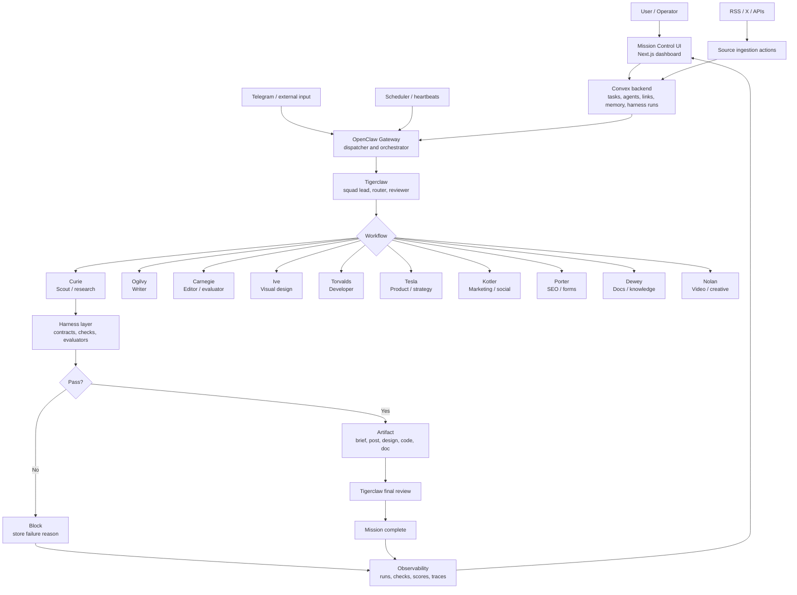
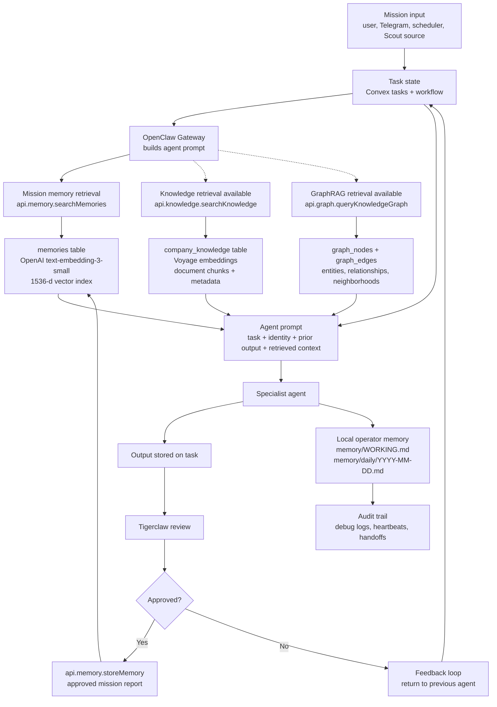
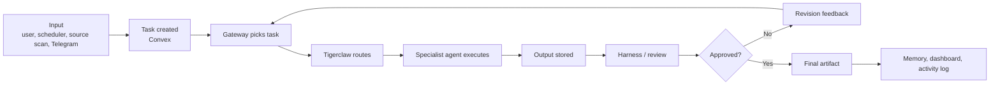
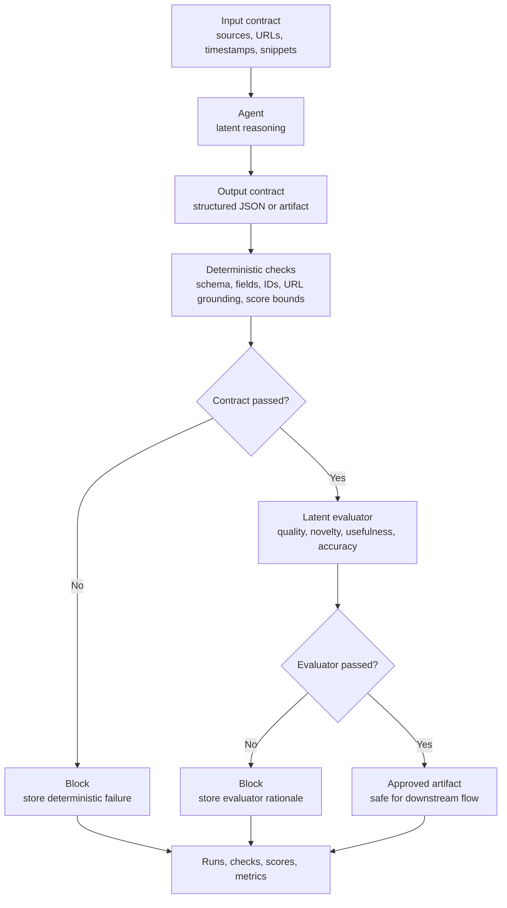

# Clawdbot the Endgame

Clawdbot - the Endgame is a local-first Mission Control system for agentic AI: a full-stack control plane for running, observing, reviewing, and improving multi-agent workflows.

It combines a persistent mission graph, an OpenClaw Gateway orchestrator, specialist agents, source ingestion, structured memory, human approval loops, and harnesses that score whether agent outputs are valid, grounded, and useful enough to move downstream.

The system is built around real operational questions: who owns the task, what context did the agent see, what did it produce, what passed, what failed, what should be retried, and what becomes part of memory.

The vision is to make agents work like an engineered operation: stateful, inspectable, improvable, and trusted across long-running workflows.

## Start here (2-minute view)

If you want to evaluate this project quickly:

1. Watch the [product walkthrough (MP4)](./docs/product-walkthrough.mp4)

This gives a compact view of the operator UI, multi-agent orchestration flow, source ingestion, and Scout intelligence loop.


## Product walkthrough

Watch the full product walkthrough here:

- [Product walkthrough (MP4)](./docs/product-walkthrough.mp4)

## What this project is

Mission Control is built around one idea:

> Agents should do judgment. Systems should handle trust.

The model can synthesize, prioritize, write, design, or reason across weak signals. The surrounding system should make that work visible, testable, reviewable, and recoverable.

This repo demonstrates:

- A persistent mission queue with agent assignment and review loops
- A gateway that orchestrates specialist agents and scheduled work
- Source ingestion through RSS, X, APIs, and operator input
- Agent-specific work surfaces for research, writing, design, code, docs, and strategy
- Human-in-the-loop review and revision
- Harness patterns for deterministic checks, evaluator scoring, and observability
- A dashboard for mission state, agent activity, Scout intelligence, and final artifacts

## Architecture at a glance


```mermaid
flowchart TD
    U["User / Operator"] --> UI["Mission Control UI<br/>Next.js dashboard"]
    TG["Telegram / external input"] --> GW
    CRON["Scheduler / heartbeats"] --> GW
    SRC["RSS / X / APIs"] --> INGEST["Source ingestion actions"]

    UI --> CVX["Convex backend<br/>tasks, agents, links, memory, harness runs"]
    INGEST --> CVX

    CVX --> GW["OpenClaw Gateway<br/>dispatcher and orchestrator"]
    GW --> ROUTER["Tigerclaw<br/>squad lead, router, reviewer"]

    ROUTER --> WF{"Workflow"}

    WF --> CURIE["Curie<br/>Scout / research"]
    WF --> OGILVY["Ogilvy<br/>Writer"]
    WF --> CARNEGIE["Carnegie<br/>Editor / evaluator"]
    WF --> IVE["Ive<br/>Visual design"]
    WF --> TORVALDS["Torvalds<br/>Developer"]
    WF --> TESLA["Tesla<br/>Product / strategy"]
    WF --> KOTLER["Kotler<br/>Marketing / social"]
    WF --> PORTER["Porter<br/>SEO / forms"]
    WF --> DEWEY["Dewey<br/>Docs / knowledge"]
    WF --> NOLAN["Nolan<br/>Video / creative"]

    CURIE --> HARNESS["Harness layer<br/>contracts, checks, evaluators"]
    HARNESS --> PASS{"Pass?"}
    PASS -- "No" --> BLOCK["Block<br/>store failure reason"]
    PASS -- "Yes" --> ARTIFACT["Artifact<br/>brief, post, design, code, doc"]

    ARTIFACT --> REVIEW["Tigerclaw final review"]
    REVIEW --> DONE["Mission complete"]

    BLOCK --> OBS["Observability<br/>runs, checks, scores, traces"]
    DONE --> OBS
    OBS --> UI
```

## Runtime model

The system has four main layers:

1. **Mission Control UI**
   - Operator dashboard
   - Mission queue
   - Agent activity
   - Scout intelligence feed
   - Source management
   - Review and approval surfaces

2. **Convex state layer**
   - Tasks and workflows
   - Agent state and activity
   - Source feeds and scouted links
   - Mission outputs
   - Memory and knowledge
   - Harness runs, checks, scores, and metrics

3. **OpenClaw Gateway**
   - Polls Convex for inbox, assigned, in-progress, and review tasks
   - Routes work to the right agent
   - Enforces one active task per agent
   - Runs scheduled heartbeats and standups
   - Bridges Telegram and local operator input
   - Hands off work between agents

4. **Specialist agents**
   - Each agent has a role definition in `squad/`
   - The gateway injects task context, prior outputs, memory, and agent identity
   - The LLM/tool runtime performs the actual latent work
   - Outputs are stored back into Convex for review and downstream use

## Memory architecture

Memory in Mission Control is a layered system that separates runtime state, reusable mission experience, source intelligence, and operator logs.


```mermaid
flowchart TD
    INPUT["Mission input<br/>user, Telegram, scheduler, Scout source"] --> TASK["Task state<br/>Convex tasks + workflow"]
    TASK --> GW["OpenClaw Gateway<br/>builds agent prompt"]

    GW --> RAG["Mission memory retrieval<br/>api.memory.searchMemories"]
    RAG --> MEM["memories table<br/>OpenAI text-embedding-3-small<br/>1536-d vector index"]

    GW -.-> KB["Knowledge retrieval available<br/>api.knowledge.searchKnowledge"]
    KB --> CK["company_knowledge table<br/>Voyage embeddings<br/>document chunks + metadata"]

    GW -.-> GRAPH["GraphRAG retrieval available<br/>api.graph.queryKnowledgeGraph"]
    GRAPH --> KG["graph_nodes + graph_edges<br/>entities, relationships, neighborhoods"]

    MEM --> PROMPT["Agent prompt<br/>task + identity + prior output + retrieved context"]
    CK --> PROMPT
    KG --> PROMPT
    TASK --> PROMPT

    PROMPT --> AGENT["Specialist agent"]
    AGENT --> OUTPUT["Output stored on task"]
    OUTPUT --> REVIEW["Tigerclaw review"]
    REVIEW --> APPROVED{"Approved?"}

    APPROVED -- "Yes" --> STORE["api.memory.storeMemory<br/>approved mission report"]
    STORE --> MEM
    APPROVED -- "No" --> REVISION["Feedback loop<br/>return to previous agent"]
    REVISION --> TASK

    AGENT --> LOCAL["Local operator memory<br/>memory/WORKING.md<br/>memory/daily/YYYY-MM-DD.md"]
    LOCAL --> OBS["Audit trail<br/>debug logs, heartbeats, handoffs"]
```

The current implementation has five memory layers:

1. **Task state memory**
   - Stored in Convex task records: title, description, status, workflow, current step, assigned agent, output, and feedback.
   - This is the system's immediate working state. It tells the gateway what exists, who owns it, what has already happened, and what should happen next.

2. **Mission memory**
   - Implemented in `convex/memory.ts` and the `memories` table.
   - Approved mission reports are embedded with OpenAI `text-embedding-3-small` and stored with `agentName`, `taskId`, `content`, tags, timestamp, and a 1536-dimensional vector index.
   - Before an agent runs, the gateway searches similar past missions with `api.memory.searchMemories` and injects the top matches into the prompt as relevant past experience.

3. **Knowledge base memory**
   - Implemented in `convex/knowledge.ts` and the `company_knowledge` table.
   - Documents are chunked by section, embedded with Voyage, stored with source/version/audience metadata, and retrieved through vector search.
   - This is for reusable factual context: company docs, positioning, pitch material, technical notes, and audience-specific reference material. The retrieval action exists today and can be wired into specific agent flows when a task needs canonical company context.

4. **Graph memory**
   - Implemented in `convex/graph.ts` with `graph_nodes` and `graph_edges`.
   - Nodes represent entities or concepts; edges represent relationships. Query expansion plus vector search retrieves a local neighborhood instead of a flat chunk list.
   - This is useful when the agent needs relationship-aware context: who connects to what, why two ideas are related, or which dependencies sit around a concept. Like the knowledge base, this is implemented as a retrieval capability that can be attached to targeted workflows.

5. **Local operator memory**
   - Implemented in `services/memory.ts` under the ignored local `memory/` directory.
   - `WORKING.md` tracks active task context, `MEMORY.md` can hold long-term local notes, and `daily/YYYY-MM-DD.md` captures gateway events, Telegram tasks, heartbeats, and debug traces.
   - This stays out of Git because it can contain private runtime history.

Scout adds a sixth practical layer: **source and artifact memory**. Links discovered by Curie are stored in `scouted_links` with URL, title, summary, tags, quality score, status, feedback, and optional task linkage. That gives the system memory of what was found, what was reviewed, what was approved, and what should not be resurfaced.

The read/write loop is intentionally simple:

1. A mission enters Convex as task state.
2. The gateway pulls task state, previous output, agent identity, and relevant retrieved memory.
3. The agent performs the latent work.
4. Output is stored back on the task.
5. Tigerclaw approves or sends it back for revision.
6. Approved work is embedded into long-term mission memory.
7. Local daily logs record the operational trace.

This separation matters because memory and trust solve different problems. Memory gives an agent context. Harnesses decide whether the agent used that context correctly. A retrieved memory should improve a run, but it should never silently override a task contract, source constraint, or deterministic harness check.

### Memory limitations and next steps

- Retrieval quality is not yet evaluated with dedicated retrieval evals.
- Mission memory stores approved reports, but it does not yet summarize, deduplicate, expire, or resolve contradictory memories.
- The gateway currently retrieves a small number of similar memories by task title; richer retrieval should use task description, agent role, source metadata, and recency.
- Knowledge base, mission memory, graph memory, and Scout links are separate stores; a future memory router should decide which store to query for each agent/task type.
- Memory writes should eventually include provenance, confidence, source citations, and privacy labels so downstream agents can distinguish facts from interpretations.

## Agent roster

| Agent | Role | Typical work |
| --- | --- | --- |
| Tigerclaw | Squad Lead | Routing, final review, synthesis, approval |
| Curie | Scout | Research, source scanning, signal extraction |
| Ogilvy | Writer | Posts, essays, copy, narrative drafts |
| Carnegie | Editor / Evaluator | Editing, quality review, evaluator judgment |
| Ive | Visual | Visual concepts, layouts, generated assets |
| Torvalds | Developer | Code, bugs, implementation tasks |
| Tesla | Product / Strategy | Specs, roadmaps, product analysis |
| Kotler | Marketing | Social strategy, positioning, distribution |
| Porter | SEO / Forms | SEO analysis, structured form workflows |
| Dewey | Knowledge | Docs, ledgers, knowledge management |
| Nolan | Creative | Video, cinematic creative direction |

## Core workflow


```mermaid
flowchart LR
    A["Input<br/>user, scheduler, source scan, Telegram"] --> B["Task created<br/>Convex"]
    B --> C["Gateway picks task"]
    C --> D["Tigerclaw routes"]
    D --> E["Specialist agent executes"]
    E --> F["Output stored"]
    F --> G["Harness / review"]
    G --> H{"Approved?"}
    H -- "No" --> I["Revision feedback"]
    I --> C
    H -- "Yes" --> J["Final artifact"]
    J --> K["Memory, dashboard, activity log"]
```

## Harness architecture

The harness layer is the key engineering idea.

An agent can produce fluent output that is still malformed, ungrounded, low-signal, or unsafe to pass downstream. A harness turns that output into something observable and governable.


```mermaid
flowchart TD
    INPUT["Input contract<br/>sources, URLs, timestamps, snippets"] --> AGENT["Agent<br/>latent reasoning"]
    AGENT --> OUTPUT["Output contract<br/>structured JSON or artifact"]
    OUTPUT --> DET["Deterministic checks<br/>schema, fields, IDs, URL grounding, score bounds"]
    DET --> DDECIDE{"Contract passed?"}
    DDECIDE -- "No" --> DBLOCK["Block<br/>store deterministic failure"]
    DDECIDE -- "Yes" --> EVAL["Latent evaluator<br/>quality, novelty, usefulness, accuracy"]
    EVAL --> EDECIDE{"Evaluator passed?"}
    EDECIDE -- "No" --> EBLOCK["Block<br/>store evaluator rationale"]
    EDECIDE -- "Yes" --> APPROVE["Approved artifact<br/>safe for downstream flow"]

    DBLOCK --> TRACE["Runs, checks, scores, metrics"]
    EBLOCK --> TRACE
    APPROVE --> TRACE
```

The split matters:

- **Deterministic checks** answer: did the agent follow the contract?
- **Latent evaluator checks** answer: was the work actually good?
- **Artifact scoring** answers: how strong is the produced object?
- **Observability** answers: what changed, what failed, and why?

## Scout harness example

Scout is the clearest example.

Curie receives a source bundle from RSS/X/API ingestion and must return 3-7 high-signal briefs. The system then evaluates the run before it can create downstream links or tasks.

### Deterministic checks

The deterministic harness checks what code can know exactly:

- Output is parseable JSON
- Output contains 3-7 candidates
- Required fields exist
- Candidate IDs are unique
- Scores are within valid ranges
- Source URLs match fetched source intel
- Known failure markers are absent

### Latent evaluator

The evaluator judges what code cannot fully know:

- Quality
- Novelty
- Usefulness
- Accuracy
- Source grounding
- Overall decision-readiness

### Score split

```text
run score        = deterministic contract compliance
artifact score   = strength of the produced candidates
evaluator score  = independent judgment of intelligence quality
total score      = weighted aggregate for dashboard visibility
```

The goal is not to pretend the LLM is deterministic. The goal is to put deterministic rails around probabilistic work, then evaluate the latent parts separately.

## Important design principle

Mission Control should not become an agent stacked on top of another agent runtime.

The cleaner model is:

```text
Mission Control = control plane
OpenClaw Gateway = orchestrator / bridge
OpenClaw or Clawdbot runtime = agent and tool execution loop
Harnesses = trust layer around specific flows
Convex = state, traces, runs, scores, artifacts
```

This avoids a recursive "agent on agent on agent" stack. The system stays understandable: one layer executes, one layer orchestrates, one layer stores state, and one layer evaluates trust.

## Repo layout

- `app/` - Mission Control UI, Scout dashboard, mission pages, setup screens
- `convex/` - schema, mutations, actions, state, source ingestion
- `gateway/` - OpenClaw Gateway runtime loop, scheduler, Telegram bridge
- `services/` - LLM, browser, image, memory, and helper services
- `squad/` - agent role definitions and pipeline prompts
- `chrome-extension/` - optional browser companion extension
- `docs/` - walkthrough media and supporting documentation
- `public/templates/` - visual templates for generated assets

## Stack

- Next.js 16 + React 19
- Convex for backend state, actions, and real-time data
- TypeScript
- Tailwind CSS 4
- Clawdbot / OpenClaw-style local agent execution
- Optional integrations with OpenAI, Google, Brave, Voyage, Telegram, RSS, and X

## Local setup

1. Install dependencies:

```bash
npm install
```

2. Copy environment variables:

```bash
cp .env.example .env.local
```

3. Start the stack:

```bash
./start.sh --detach
```

4. Open the app:

- App: `http://localhost:3000`
- Scout: `http://localhost:3000/scout`
- Setup: `http://localhost:3000/setup`
- Skills: `http://localhost:3000/skills`

## How to evaluate the system

For any agent workflow, ask five questions:

1. What is the input contract?
2. What is the output contract?
3. What can be checked deterministically?
4. What requires latent evaluator judgment?
5. Where are runs, scores, traces, and failures persisted?

If those five answers are clear, the agent is becoming an engineered system instead of a demo.

## Notes on this public version

This repo is a public-ready extract from a larger private workspace. Private logs, runtime memory, local automation state, credentials, and personal environment files are intentionally excluded.

Some experimental harness work is developed in a separate local harness repo first, then promoted back only after the pattern proves useful.
